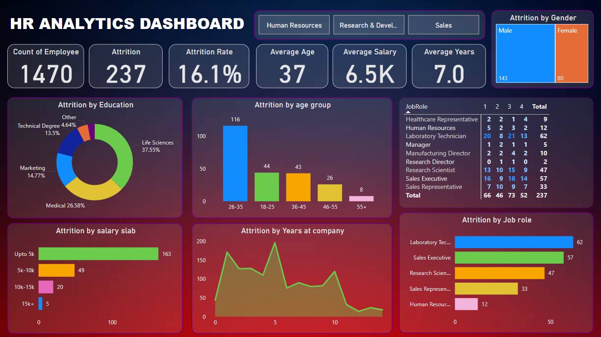

# HR-Analytics-Using-Power-BI
This repository contains a comprehensive HR Analytics report developed using **Power BI**. The report aims to provide insights into various HR metrics to support decision-making and workforce management. Below, you will find an overview of the report, key features, and how to view it.

## Report Overview

The HR Analytics report is designed to help HR teams and organizational leaders:

- Analyze employee performance and retention trends.
- Identify factors contributing to employee attrition.
- Monitor workforce diversity metrics.
- Evaluate training and development programs.
- Track key HR KPIs, such as absenteeism rates, job satisfaction, and employee engagement.

## Key Features

1. **Interactive Dashboards**: Visually rich and interactive dashboards that allow you to filter and drill down into specific data points.
2. **Data-Driven Insights**: Comprehensive analytics derived from real-world HR datasets.
3. **Dynamic Visualizations**: Graphs, charts, and tables that update dynamically based on filters and slicers.
4. **Customizable Reports**: Easily adapt the report to suit your organization's unique needs.

## Screenshots

Here is the preview of the report's visual:



## How to Use This Report

1. Clone this repository:
   ```bash
   git clone https://github.com/yourusername/hr-analytics-report.git
   ```

2. Open the Power BI file `HR_analytics_report.pbix` using [Power BI Desktop](https://powerbi.microsoft.com/).

3. Explore the report using the available filters and slicers.

## About the Dataset

The dataset used for this report includes anonymized HR data, such as:

- Employee demographics
- Job roles and departments
- Performance ratings
- Attrition data
- Compensation and benefits
